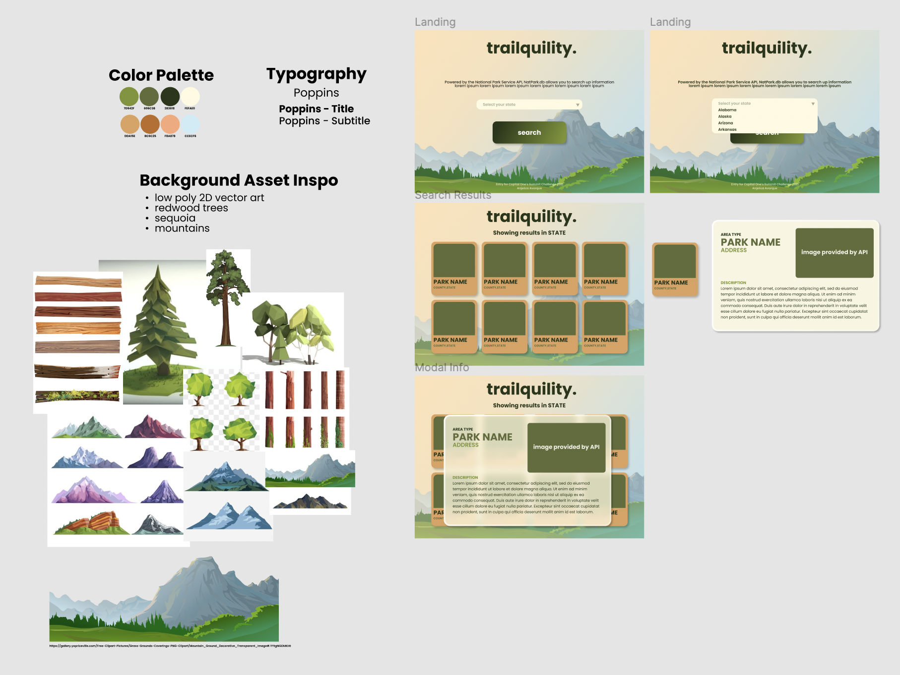

# trailquility.
### Submission for Capital One's 2021 Software Engineering Summit.
----
## What is Trailquility?
Website Link: https://trailquility.vercel.app/

Trailquility is a web application that utilizes the [National Park Service API](https://www.nps.gov/subjects/developer/get-started.htm) to give users information regarding National Parks in their area.

----
## Ideation

Before I started coding the website, I drafted out my first idea on Figma so I could better visualize the site as I was coding. Originally, I had the idea to add a parallax effect on flat 2D assets of mountains and trees. As the cursor moved, so would the background. 

However, as the site started to come together, I was not able to execute the idea well enough to my standards. So I scraped the whole parallax idea altogether and decided to try something else. Despite that, I was adamant about having a moving background, so I tried implementing a video background instead. Thankfully, that attempt was a success as evident by the website.

----
## Technical Details

Trailquility's front-end is made using React and material-ui and is deployed through Vercel.

The site consist of five main pages that the user can browse through using the navigation buttons laid throughout the site:
- The Home/Landing page
- Parks List page
- Activities page
- Park Stream page
- "The View"
----
#### The Home Page

The Home Page features a glassmorphism UI overlayed over a video background of a waterfall surrounded by trees. The Home Page features one button that will immediately take the user to a list of all the national parks.

#### The Parks List Page

 
Created using `Header.js`, `Parks.js` and `ParkCard.js`, the Parks Page is the page that the user sees after clicking the button on the Home Page.

`Parks.js` implements both of the JavaScript files to render what the user sees in the above image. `Header.js` provides the navigation buttons, which were absent from the Home Page, are now available for the user to use to navigate through the site. `ParkCard.js` renders the API information called by `Park.js` into presentable card columns.

#### The Activities Page

Similar to the Parks List Page, the Activities Page is made using `ParksNRec.js`, `Header.js`, `Activity.js`, `Activities.js` and `ParkCard.js`.

`Activity.js` renders the button template for `Activities.js` to pass the data into and renders all available activities from the API into clickable buttons. Using the buttons, the user is able to filter through the Park List by activities. If the user wants to be able to reset their selection, they can do so by clicking the 'Clear' button.

#### The Park Stream Page

Made using `ParkStream.js`, `StreamCard.js` and `Header.js`, Park Stream shows a grid of non-streaming images collected from the park webcams. The user is able to click the buttons in order to view the stream and its description. If there is no available streaming image, the card will say 'Stream not available'.

### "The View"

"The View" was a fun bonus page that I thought to include after staring at the website background for a long time while coding. The video I used for the background is from [this site right here](https://www.pexels.com/video/tall-waterfall-5738272/).

----

## Challenges
- Trying to implement the original parallax background idea was technically challenging because every attempt I did was not up to my own personal standards. As a result, the entire idea was scrapped in favor of the video background idea.
- Making API calls and testing them. I haven't had much experience dealing with APIs so trying to get them to render and to display the information I wanted was challanging.
- Slow load times for images
